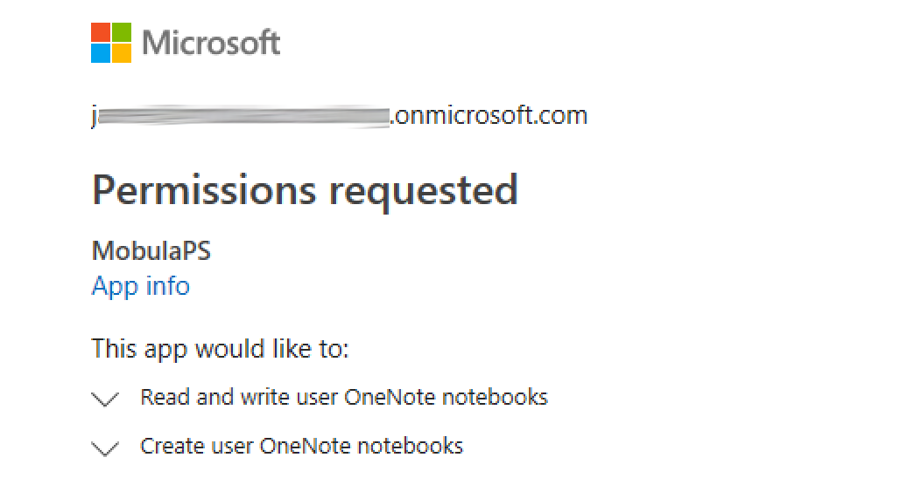
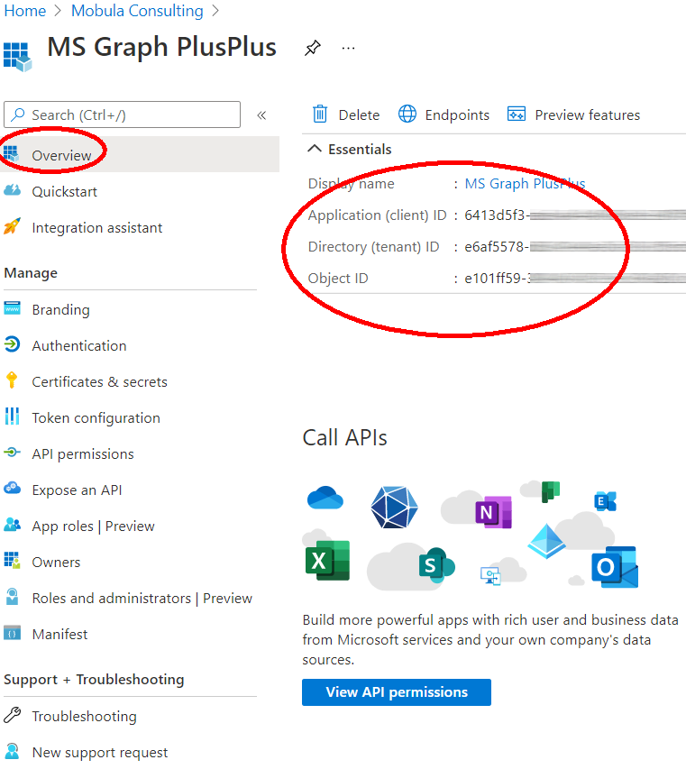
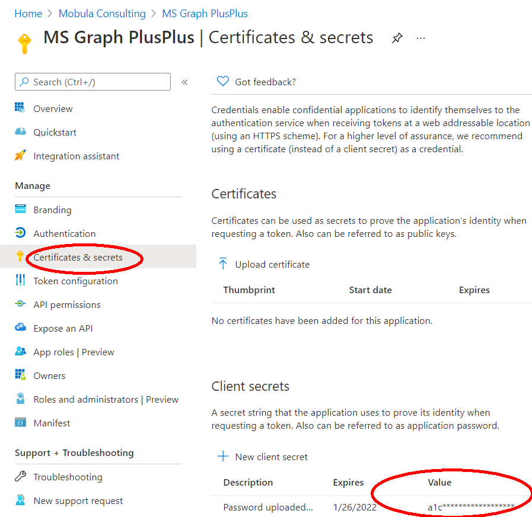
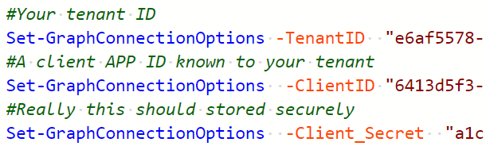
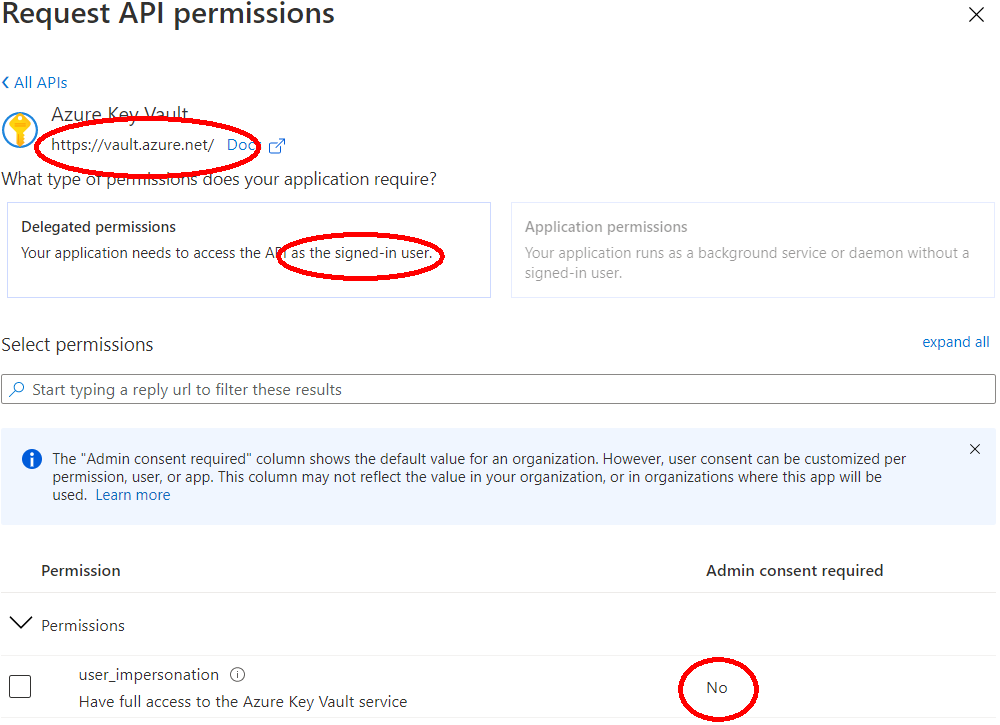

When anything calls the APIs it needs a token which says
-   Some client program
-   Is authorized to use some functionality
-   On behalf of some user

In order to get a token the application identifies itself to the logon service and the user goes through a normal logon process. If the user logs on through a web page the logon process can ask
"Do you want application X to do A,B and C on your behalf"

In the picture above, the app has sent a GUID to the Microsoft login service which recognizes it as "MobulaPS", it has told the service the *scope* of actions it wants to carry out. And the logon process has seen that this user has not given this app access to that scope before An interactive login with a new application, or extending the scope of existing one, triggers a consent dialog - consent can be revoked but it is remembered so the user doesn't need to re-approve the scopes. And once the token has been granted the user may not need to logon again - the app may get a refresh token - with the token it can authenticate itself, present the token and ask for a new (time limited) access token.

Some scopes must be enabled by an administrator, the others can be approved by ordinary users

Admins see a checkbox which allows them to consent to the use of scopes and this pre-approves them for the user

There are other methods to get a token which don't involve a dialog box. If you're reading this in conjunction with the the Graph module and are happy to open
However they have to send something back to the user and say "The app is asking for...", so either the user must have logged in interactively to grant it or the adminstrator must have done so for them. As well as users being security principals - who delegates permission to act for them for some scope(s) apps can also be security principals and the Administrator can configure the app with permissions to the act independently.

For published apps you may need to go to Enterpise Apps in Azure Active Directory, or you can create and manage apps from App registrations
You need 3 peices of information to set up the the app for use from PowerShell. The Tenant appears in many places including on the app's overview page, where Client ID appears

The third item is a secret and you add the secret from _certificates and Secrets_.

These 3 pieces of information go into the AuthSettings.PS1 file

Now you can grant the permissions to the app.
In Api Permissions for a registered app you can click + and select something to grant permisions too - often this will be Microsoft Graph but for the example below I have used the Azure keyvault

At the top of the permissions page is the URL that will be called for the rest API and then there is a selection - are these delegated permissions the app can excercise for a user, or are they permissions for the App itself. Here we're granting the only scope - have access to the vault as the user - and this doesn't need to be authorized by administrator. Back on the permissions summary page we can see one of the graph scopes DOES need admin consent before it can be used, and the graph scopes have all been previously pre-authorized. If we click "Grant Adminsitrative consent" that will pre-authorize the newly added scope.

## 4 things which go wrong.

1. You use the wrong tennantID, so you try to login as you@yourdomain using my tenant. The logon process will set you straight on that.
2. You use a client (APP) ID that isn't known to your tennant. 
3. You try to use a client app for which you don't have a corresponding secret, your app can't claim to be Office 365
4. You don't grant the right scopes. Either the application doesn't request them when doing an intereactive login, or the app hasn't been assigned them 

4 Kinds of request
1. Here are my credentials as an App: can I have token to act as myself ?
2. I'd like this access, please log a user on and and send something through them that only this app-id can exchange for a token.
3. Here are my credentials as an App: please exchange _this_ for a token.  _This_ might have come from a logon, or might be a refresh token
4. Here are my credentials as an App: I'd like this access, can I send a user to you to logon. When they do, please send me an access token for the session. 
5. Here are my credentials as an App: A user has given me their user name and password. Can I have a token to act for them under my permitted scopes. 

